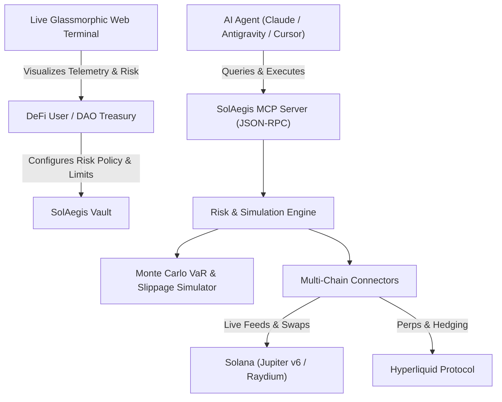

# 🛡️ SolAegis DeFAI
> **Autonomous Multi-Chain AI Agent Risk & Execution Protocol for Solana & DeFi**  
> *Targeting the Colosseum Crypto World\'s Fair 2026 ($840,000 Prize Pool | $15,000 Project Awards)*

[](https://github.com/ashusatyarthi-wq/solaegis-defai/actions)
[](https://opensource.org/licenses/MIT)
[-9945FF)](https://modelcontextprotocol.io)
[](https://solana.com)
[](https://github.com/sponsors/ashusatyarthi-wq)

---

## 📌 Problem Statement
As autonomous AI agents (`AgentKit`, autonomous trading loops, DeFAI bots) proliferate across Solana and Web3, **they are prone to catastrophic drawdown**. Traditional agentic implementations execute naive swap intents without:
1. **Mathematical position sizing** (leading to over-allocation and ruin).
2. **Dynamic risk ratchets** (failing to lock in profits or trail stop-losses).
3. **Pre-trade stochastic shock modeling** (ignoring fat-tailed slippage and liquidity crunches).
4. **Standardized agent interoperability** (lacking standardized tools for Claude, Antigravity, and Cursor).

## 💡 The Solution: SolAegis DeFAI
**SolAegis** is an autonomous risk management engine and standardized **Model Context Protocol (MCP)** server that equips any AI agent with institutional quantitative guardrails before and during on-chain execution on Solana and Hyperliquid.



---

## 🚀 Key Architectural Innovations

### 1. Institutional Quantitative Math Engine
- **Half-Kelly Capital Allocation**: Calculates optimal position size $$f^* = \frac{p(b+1) - 1}{2b}$$ bounded by a strict 25% single-position ruin cap.
- **Parametric Value-at-Risk (VaR 95%) & Conditional VaR (CVaR)**: Institutional tail-risk modeling calibrated against daily crypto volatility.
- **Dynamic Breakeven Ratchet**: Automatically moves stop-loss to entry price + fee buffer as soon as unrealized PnL reaches $+2.0\%$, locking in capital preservation.
- **1:3.0+ Asymmetric Payoff Targeting**: Enforces a minimum 1:3 reward-to-risk ratio on all agent executions.

### 2. Stochastic Monte Carlo Simulator
- Generates 5,000 Geometric Brownian Motion (GBM) paths with **jump diffusion** to model black-swan slippage events and oracle lag.
- Provides 5th percentile (tail-loss), median (50th), and 95th percentile upside outcome curves.

### 3. Autonomous Circuit Breaker Sentinel
- **Flash Crash Velocity Detection**: Halts trading and initiates emergency de-leveraging if asset price falls $>4.5\%$ within 15 minutes.
- **Liquidity Spread Guard**: Blocks execution if DEX bid-ask spread widens past threshold.
- **Stablecoin Depeg Monitor**: Triggers immediate defensive hedge if USDC/USDT deviates $>1.2\%$ from $1.00.

### 4. Model Context Protocol (MCP) Standard Compliance
Exposes 5 standardized tools compatible with Anthropic Claude Desktop, Google Antigravity, Cursor, and custom agent loops:
- `solaegis_analyze_risk`: Computes Kelly fraction, VaR, CVaR, and dynamic stops.
- `solaegis_run_monte_carlo`: 5,000-path stochastic trajectory analysis.
- `solaegis_inspect_solana_wallet`: Live SOL balance and Jupiter v6 routing evaluation.
- `solaegis_check_circuit_breaker`: Real-time market health and flash-crash evaluation.
- `solaegis_get_hyperliquid_funding`: Hyperliquid funding rate and perpetual market intelligence.

---

## ⚡ Quickstart

### Prerequisites
- Node.js >= 20
- npm >= 10

### 1. Clone & Install
```bash
git clone https://github.com/ashusatyarthi-wq/solaegis-defai.git
cd solaegis-defai
npm install
```

### 2. Run Autonomous Diagnostic
```bash
npm start
```

### 3. Run Test Suite
```bash
npm test
```

### 4. Launch MCP Server (for Claude / Agent UI)
```bash
npm run mcp
```

To connect to Claude Desktop or Antigravity, add to your `claude_desktop_config.json`:
```json
{
  "mcpServers": {
    "solaegis": {
      "command": "node",
      "args": ["/path/to/solaegis-defai/dist/mcp/server.js"]
    }
  }
}
```

---

## 🌐 Live Web Terminal
Open `web/index.html` in any modern browser or visit the live deployment at:  
👉 **[https://ashusatyarthi-wq.github.io/solaegis-defai/](https://ashusatyarthi-wq.github.io/solaegis-defai/)**

---

## 🏆 Colosseum Crypto World\'s Fair Submission Details
- **Tracks**: Solana / AI Agents / DeFAI
- **Repository**: [https://github.com/ashusatyarthi-wq/solaegis-defai](https://github.com/ashusatyarthi-wq/solaegis-defai)
- **Author**: Nitesh Satyarthi (`ashusatyarthi-wq` | `ashusatyarthi@gmail.com`)
- **License**: MIT

---

## 💖 Sponsor & Back SolAegis Development
If you find SolAegis DeFAI valuable for protecting your autonomous agents or Solana protocols, consider supporting its open-source development:
- **GitHub Sponsors**: [https://github.com/sponsors/ashusatyarthi-wq](https://github.com/sponsors/ashusatyarthi-wq)
- **Sponsorship Tiers**:
  - **Supporter ($5 - $15/mo)**: Supporter badge and recognition in release notes.
  - **DeFAI Protocol Integration ($50 - $100/mo)**: Priority issue triage and risk model consultation.
  - **Custom Vault & Enterprise Security ($500+ one-time / mo)**: Custom Anchor invariant verification and dedicated MCP connectors for your trading fund or protocol.

